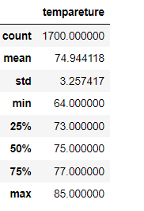
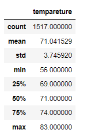

# Surfs Up
This project aims to analyze weather data in Hawaii to help in decision making regarding financing of a proposed ice cream business in a surfing island spot.
Data is available and and could be downloaded on local machines. There is sufficient daily data spanning a few years for tempareture and precipitation from a number of stations spread around the area under consideration. Diverse data protects against narrow scope and provides a broader consideration.
### Business Viability Considerations
It can be reasonably assumed that ice cream consumption would depend on people venturing for surfing spots and have access to ice cream vendor. The surfing interest could depend on precipitation and on temperature. First part of the analysis consisted of rain falls. The next part of the analysis looks at the daily temperatures. 
Also, the tremperature distribution during surfing season alone does not provide the viability of ice cream shop as on going business. So the temparetures at off season (in month of December) is also looked at to be informed as to the business viability year round.  
Following snapshots provide snapshots for statistics for month of June and December: 
                         

* Difference between mean temperatures in June and December is close to 4&deg;F.
* Difference between minimum temperatures is about 8&deg;F.
* Difference between maximum temperatures is 2&deg;F.

### Summary
The statistics provide reliable information about the weather variation between June and December considered to be peak extreme weather conditions.
The information would help in making decision for investement in the icecream business proposal for the investor. A reasonable conclusion from the data analysis would be that seasonal temperature variation is mild in the target area and the ice cream business is expected to do well. However, the analysis would be robust if the metric for rainfall is included in the consideration set. Since the available dataset includes precipitation data, additional queries for rainfall in June and December would round up the analysis. Only temperature consideration leaves out the risk of business slowdown due to heavy rains. Also since the data is already available in the dataset, no additional data gathering is needed. 
The analysis would be more robust if both temperature and precipitation are considered for business viability year round.
